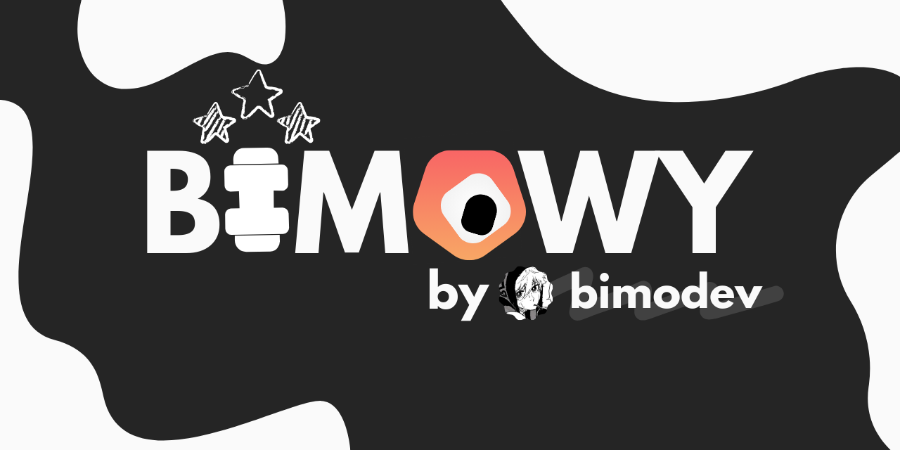

# Where curiosity makes the rules

A project aimed at helping and guiding students in all math subjects. Inspired by [Khan Academy](https://www.khanacademy.org/) & [Brilliant](http://brilliant.org/)

# 🌐 Supported Languages:

- `French (fr-FR)`
- `English (en-US)`

#  Demo

https://github.com/user-attachments/assets/86ffbc81-22b3-4c4a-a035-1651f07a3070

If you don't like using your mouse like me, just press <code>Enter</code> and the website will know what to do (Start/Next/Try again/End/Focus on the next input etc..)

# ⚙️ Setup

1. Clone the repository with either
   - [Using `git clone` or the green download button `Code` on top](https://docs.github.com/en/repositories/creating-and-managing-repositories/cloning-a-repository)
   - [Github Desktop](https://github.com/apps/desktop)
2. Create a supabase database and put the correct environement variables into an `.env` file (you have the copy & rename [`.env.example`](.env.example))
3. Run the development server with `npm run dev`
4. Open your browser and visit `http://localhost:3000`
5. If you want to seriously test the website, use `npm run build`, then `npm run start`, this will make the whole server work extremely fast allowing you to test the platform with ease.

# 📄 License

This project is licensed under the MIT License - see the
[LICENSE](LICENSE) file for details.

